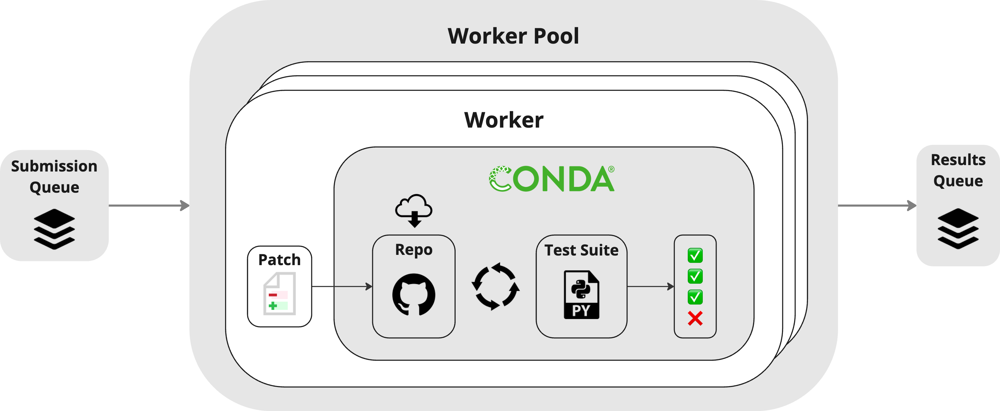

# RES-Q
[](https://opensource.org/licenses/MIT)
[](https://www.python.org/downloads/release/python-380/)
[](https://arxiv.org/abs/2406.16801) [](https://huggingface.co/datasets/Qurrent/RES-Q)

## Overview
RES-Q is a codebase editing benchmark consisting of 100 hand-crafted, compact natural language edit instructions.
The task is to, given an edit instruction and a codebase, make an edit to the codebase that satisfies the instruction.

RES-Q can be accessed via [🤗 Datasets](https://huggingface.co/datasets/Qurrent/RES-Q) with the following code snippet:
```python
from datasets import load_dataset
dataset = load_dataset("Qurrent/RES-Q", split="test")
```

## Top 10 Leaderboard

| Rank | System | RES-Q Score (% pass@1) |
|------|--------|----------------------|
| 1    | QurrentOS-coder + Claude 3.5 Sonnet | 58 |
| 2    | QurrentOS-coder + GPT-4o | 46 |
| 3    | QurrentOS-coder + GPT-4T | 37 |
| 4    | QurrentOS-coder + Claude 3 Opus | 36 |
| 5    | QurrentOS-coder + GPT-4 | 30 |
| 5    | QurrentOS-coder + Gemini 1.5 Pro | 30 |
| 7    | QurrentOS-coder + DeepSeek Coder V2 Instruct | 26 |
| 8    | QurrentOS-coder + Llama 3 70b | 20 |
| 9    | QurrentOS-coder + Qwen2-72B Instruct | 16 |
| 10    |  |  |

> **Contribute to the Leaderboard**: If you've achieved results that could make it to our top 10 leaderboard, we'd love to hear from you. Please open a GitHub issue titled "Leaderboard Update Request" with your system name, score, approach, and run logs. 

## Submission Environment

In this repository, we provide a **Submission Environment** which serves as an evaluator for completed RES-Q tasks. Given a unified diff patch file representing a codebase edit, the environment produces detailed feedback about the success of the edit with respect to the task instruction.

<div align="center">
<p align="center">
  
</p>
</div>


##  Set Up

Ensure you have `conda` installed on your system. If not, you can install it from the [official Anaconda website](https://www.anaconda.com/products/individual).

#### Install from source:
1. Clone the repository and move into its directory:

```bash
git clone https://github.com/Qurrent-AI/RES-Q.git && cd RES-Q
```

2. Install the `pip` package:

```
pip install -e .
```

## Usage

### Python Interface
We provide a simple python interface to interact with the RES-Q dataset and submission environment.

To build a submission environment, we must first instantiate a `RESQDataset`:
```python
from datasets import load_dataset
from resq.dataset import RESQDataset

hf_dataset = load_dataset("Qurrent/RES-Q", split="test")
dataset = RESQDataset(hf_dataset)
```

Then, we can instantiate a `SubmissionEnv` with the dataset:  
```python
from resq.submission import SubmissionEnv
env = SubmissionEnv(
    dataset=dataset, temp_dir="temp/", persist=True
)
```
> **Note:**
> The `temp_dir` argument specifies where the submission environment will store temporary files. If `persist` is set to `True`, the environment will persist the generated files for future use. Persisting generated files significantly speeds up future submissions (~5mins vs ~20s to process 100 submissions).

We can then step through the environment with a single `Submission`: 
```python
from resq.models import Submission, SubmissionResult
submission = Submission(id="0_0", patch=dataset["0_0"].solution_patch)
result = env.step(submission=submission)
```
```python
>>> result
SubmissionResult(id='0_0' success=True message='PASS' test_suite_feedback='')
```

We can also process a batch of `Submission`s asynchronously with a specified number of workers:
```python
submissions = [
    Submission(id=entry_id, patch=entry.solution_patch) for entry in dataset
    ]

results = env.step_batch(submissions=submissions, n_workers=4, pbar=True)
```
```python
>>> results
[SubmissionResult(id='0_0' success=True message='PASS' test_suite_feedback=''), ...]
```

### Command Line Interface (CLI)
Alternatively, the submission environment can be invoked from the command line using the `scripts/submit.py` script:

```
python scripts/submit.py \
    --submissions_file [Required] [.json]  Path to JSON file containing submissions \
    --env_temp_dir    [Required] [folder]  Where to build the submission environment's temporary files  \
    --dataset_file     [Optional] [.json]  Path to RES-Q dataset JSON file (default: None, will use HuggingFace if not provided) \
    --results_file     [Optional] [.json]  JSON file to write the results to (default: results.json) \
    --persist_env     [Optional] [bool] Persist generated environment files for future use (default: True) \
    --enable_pbar     [Optional] [bool] Enable progress bar (default: True) \
    --n_workers       [Optional] [int]  Number of async workers to process submissions with (default: 1)
```

with `submissions_file` as a json file containing your submissions in the following format:

```json
[
	{
		"id": "string",
		"patch": "string"
	},
	{
		"id": "string",
		"patch": "string"
	},
]
```

### Cleanup
The submission environment creates `conda` environments to manage different dependencies across tasks. To remove these environments and other files generated by the submission environment, you can use the `scripts/cleanup.py` script:

```
python scripts/cleanup.py \
    --env-temp-dir [Optional] [folder]  Path of the environment temp directory to clean, if it exists.
```

If `--env-temp-dir` is not provided, conda environments that match the pattern `^test_env_[0-9a-fA-F-]{36}$` will be removed.


## ️ Downloads
The RES-Q benchmark dataset can be found on HuggingFace: [https://huggingface.co/datasets/Qurrent/RES-Q](https://huggingface.co/datasets/Qurrent/RES-Q)


## ️ Citation
If you find our work helpful, please use the following citation.

```
@misc{labash2024resq,
      title={RES-Q: Evaluating Code-Editing Large Language Model Systems at the Repository Scale}, 
      author={Beck LaBash and August Rosedale and Alex Reents and Lucas Negritto and Colin Wiel},
      year={2024},
      eprint={2406.16801},
      archivePrefix={arXiv},
      primaryClass={cs.CL}
}
```


## License
MIT. Check `LICENSE.md`.